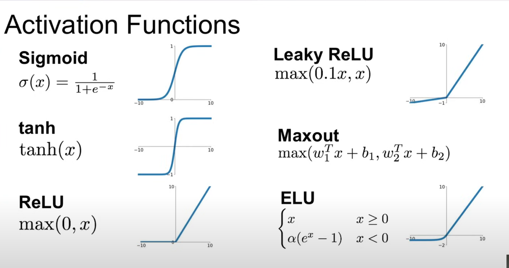

# 激活、梯度和归一化

MLP 是最基础的前馈神经网络，由多个全连接层（linear + 激活函数）堆叠而成。当网络层数增多时，会出现一系列训练上的挑战，比如梯度消失/爆炸、激活分布不稳定等。

有必要讨论这些深层网络在前向传播和反向传播过程中，内部数值（激活值、梯度）的统计特性。

## 前向传播中的激活

在每一层线性变换后，经过激活函数得到输出。当堆叠许多层时，这些激活值的均值、方差、分布形状可能会发生剧烈变化，导致：

1. 某些层的输入分布不稳定
2. 激活函数进入非线性饱和区（比如 sigmoid/Tanh 的两端梯度接近 0）

## 反向传播中的梯度

损失函数对网络权重的导数，在反向传播过程中逐层传递。如果梯度变得过大或者过小，会导致：

1. 梯度爆炸：权重更新过大，模型无法收敛，甚至数值溢出
2. 梯度消失：靠近输入层的权重几乎得不到更新，网络几乎学不到东西

## 常见激活函数



## batch normalized

在神经网络比较深层的情况下，调整权重矩阵的尺度会变得非常困难，可以通过在神经网络中添加这些批量归一化层，然后控制神经网络中这些激活的尺度，这可以显著地稳定训练。

在线性层后面添加归一化层，这样在进行激活之前，可以控制数值的尺度，避免数值过大或者过小，减轻训练不稳定的问题。

使用 BN 之后线性层就不需要 bias 了，因为 bias 会在执行归一化时被均值减去，另外 BN 层还会添加 bn bias。 

需要理解激活函数，梯度和他们在神经网络中的统计数据的重要性，这一点变得越来越重要，尤其是神经网络变得更大更深的时候。

我们希望能控制激活函数，以避免他们的输出值被压缩为 0 或者数值爆炸到无穷大。

tanh 层允许我们将这些叠加的线性层从一个线性函数变成一个神经网络，理论上可以近似任何函数。

通过 BN 层，我们将数据的激活进行居中，我们可以这样做的原因是居中操作是可微的。

- tanh 激活函数在一个压缩函数，所以在执行推理时需要增加一个权重增益，以避免数值持续缩小。需要非常仔细地设置这些增益值，以便于在前向传递和后向传递中获得良好的激活。如果在激活层前加入 BN 层，那么就不需要小心翼翼地设置权重增益了

学习使用诊断工具来动态了解神经网络是否处于良好状态，我们可以查看下列统计数据的直方图：

1. 前向传播的激活值
2. 反向传播的梯度
3. 权重被更新部分的均值、标准差、梯度与数据的比率

## 笔记

初始化参数会对性能产生影响，如果权重处在一个很差的分布上，则有些神经元可能会死掉。

模型深度越深，越复杂，对这些问题的容忍程度就越低。

## 大模型中的 norm layer

Transformer 的解码器层通常包含自注意力模块和前馈网络（FFN），两者后均接 Layer norm，推理时 layer norm 的作用时稳定自注意力输出和 FFN 输出的分布，避免激活值过大或过小导致的数值溢出。

```py
class DecoderLayer(nn.Module):
    def __init__(self, d_model, nhead):
        super().__init__()
        self.self_attn = nn.MultiheadAttention(d_model, nhead)
        self.norm1 = nn.LayerNorm(d_model)  # 自注意力后的LayerNorm
        self.ffn = nn.Sequential(
            nn.Linear(d_model, 4*d_model),
            nn.GELU()
        )
        self.norm2 = nn.LayerNorm(d_model)  # FFN后的LayerNorm

    def forward(self, x):
        # 自注意力计算（推理时无mask）
        attn_output, _ = self.self_attn(x, x, x)
        x = x + attn_output  # 残差连接
        x = self.norm1(x)    # 推理时：对当前样本的d_model维特征计算均值/方差并归一化
        
        # FFN计算
        ffn_output = self.ffn(x)
        x = x + ffn_output   # 残差连接
        x = self.norm2(x)    # 再次归一化，稳定FFN输出
        return x
```

